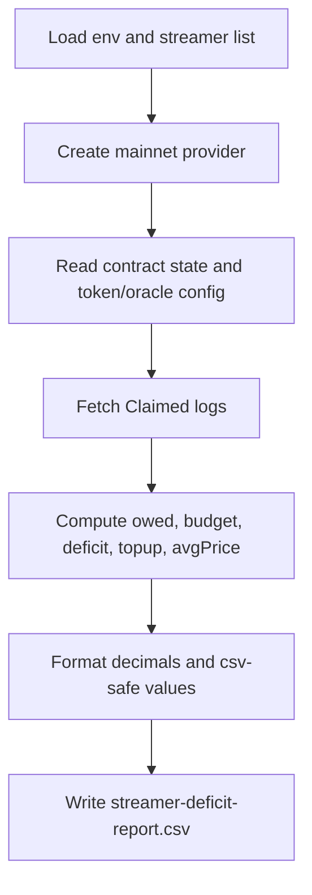

# Streamer Deficit CSV Plan

## Goal

Generate a CSV report for the four provided streamer addresses with these columns: address, vendor, claim asset, claimed amount, current COMP balance, claimable COMP now, claimable USD/USDC now, stream finish (timestamp + UTC), budget in days, days deficit, required top-up, and average realized COMP claim price.

## Files to Add/Update

- Add script: `[/Users/dmitriy/Desktop/programming/vendor-streamer-stats/scripts/generate-streamer-deficit-report.ts](/Users/dmitriy/Desktop/programming/vendor-streamer-stats/scripts/generate-streamer-deficit-report.ts)`
- Add npm script entry in `[/Users/dmitriy/Desktop/programming/vendor-streamer-stats/package.json](/Users/dmitriy/Desktop/programming/vendor-streamer-stats/package.json)`
- Reuse ABIs: `[/Users/dmitriy/Desktop/programming/vendor-streamer-stats/streamer.v1.json](/Users/dmitriy/Desktop/programming/vendor-streamer-stats/streamer.v1.json)`, `[/Users/dmitriy/Desktop/programming/vendor-streamer-stats/streamer.v2.json](/Users/dmitriy/Desktop/programming/vendor-streamer-stats/streamer.v2.json)`
- Output file (generated): `[/Users/dmitriy/Desktop/programming/vendor-streamer-stats/streamer-deficit-report.csv](/Users/dmitriy/Desktop/programming/vendor-streamer-stats/streamer-deficit-report.csv)`

## Calculation Rules (locked)

- **Avg claim COMP price**: from `Claimed` events only (event-implied), as total native claimed (USD/USDC units) divided by total COMP claimed.
- **Stream finishes in**: include both unix timestamp and UTC date string.

## Metric Mapping

- `claim asset`: infer from contract config
  - v1: fixed `USDC`
  - v2: detect by `nativeAssetOracle` address (USDC feed vs constant USD feed in deployed config)
- `claimed amount`: cumulative native supplied (`suppliedAmount` for v1, `nativeAssetSuppliedAmount` for v2)
- `comp balance`: ERC20 `balanceOf(streamer)` for COMP token
- `Available to claim COMP`: simulate current owed native -> convert via contract conversion function
  - v1: `calculateCompAmount(getAmountOwed())` capped by current COMP balance
  - v2: `calculateStreamingAssetAmount(getNativeAssetAmountOwed())` capped by current streaming asset balance
- `available to claim` (USD/USDC): owed native amount now, adjusted down if balance shortfall (same cap logic contract uses)
- `Stream finishes in`: `streamEndTimestamp` and UTC date
- `Budget for days`: native value of current token balance divided by daily native stream rate
- `Days deficit`: max(0, remaining days until stream end - budget days)
- `Required top up`: native amount needed to cover deficit days (same units as claim asset)

## Implementation Flow

## Technical Approach

- Use `ethers` v6 + native `fs` CSV string generation (no CSV dependency needed).
- Pull all claim events from contract deployment block (or block 0 fallback) to latest.
- Keep math in bigint, format to decimal strings at output boundary.
- Add robust guards for edge cases:
  - non-initialized streams
  - terminated v2 streams (`getStreamEnd()`)
  - zero claimed COMP (avg price = 0)
  - oracle/feed mismatches (emit explicit error per stream row)

## Validation

- Run script against provided 4 addresses using `RPC_MAINNET` and `ETHERSCAN_API_KEY` from env.
- Sanity-check each row:
  - `claimed amount` approximately matches sum of event native amounts
  - capped claimable values never exceed current COMP balance conversion
  - deficit/top-up is zero when budget days >= remaining days
- Run lints on touched files and resolve any new diagnostics.

